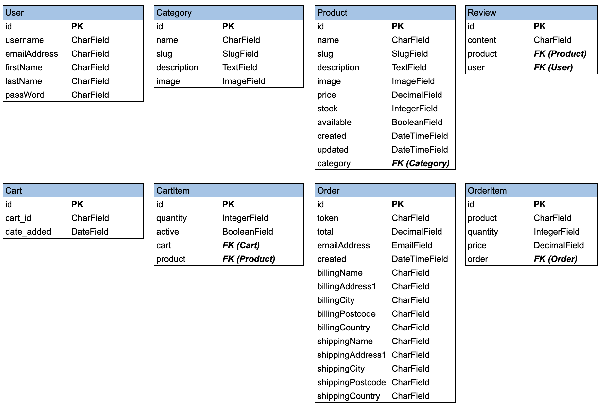

- [Overview](#overview)
- [UX](#ux)
  - [User Stories](#user-stories)
  - [Design](#design)
    - [Frameworks](#frameworks)
    - [Color Scheme](#color-scheme)
    - [Icons](#icons)
    - [Typography](#typography)
  - [Wireframes](#wireframes)
  - [Schema](#schema)
- [Features](#features)
  - [Existing Features](#existing-features)
  - [Future Features](#future-features)
- [Technologies Used](#technologies-used)
  - [Front-End Technologies](#front-end-technologies)
  - [Back-End Technologies](#back-end-technologies)
    - [Django](#django)
    - [Heroku and AWS](#heroku-and-aws)
    - [Python](#python)
- [Testing](#testing)
- [Deployment](#deployment)
- [Credits](#credits)
  - [Media](#media)

<br/>

---

## Overview

Shopist is an e-commerce site for purchasing boutique furniture items. You can view the deployed site 
[here](https://shopist-dml.herokuapp.com/). 

<br/>

## UX

This project is part of the [Code Institute](https://codeinstitute.net/) Full Stack Software Development course, 
specifically **Module 4: Full Stack Frameworks with Django**. 

The objective for this milestone project is to "*build a full-stack site that allows your users to manage a common 
dataset about a particular domain*".

<br/>

### User Stories

- User Stories were written from the perspective of x2 different user(s):
    - the non-registered user that wants to view products, reviews on those products, without purchasing. 
    - the registered user that wants to purchase products, review their profile and purchase history, and leave reviews on products.

<br/>

"**__As a *non-registered user*, I__** ______________________________________________"

- should be presented with products on the main page. 
- should be able to click on a product on the main page to view the product description, reviews, etc. 
- should be able to search through products.
- should be able to register an account with the site in order to purchase products, and review them. 

<br/>

"**__As a *registered user*, I__** ______________________________________________"

- should be able to login to the site in order to purchase products. 
- should be presented with a profile page showing my details. 
- should be able to make purchases using Stripe. 
- should be able to view purchase history from my profile page.
- should be able to write reviews on any other products.   
- should be able to logout of my account. 

<br/>

### Design

- The site has been designed using a modern and minimalist concept, with an overall clean, crisp look.

<br/>

#### Frameworks

- [Django 3.2.5](https://docs.djangoproject.com/en/3.2/releases/3.2.5/) is a framework that is used to render the back-end Python with front-end Bootstrap. 
- [Boostrap v4.5](https://getbootstrap.com/) is a free and open-source CSS framework directed at responsive, mobile-first front-end web development. It contains CSS -and (optionally) JavaScript- based design templates for typography, forms, buttons, navigation, and other interface components.

<br/>

#### Color Scheme

Minimalist colors are employed. 

- In keeping with the overall *modern* theme, I have opted for a bright color scheme, with plenty of white space. Primary and secondary site colors are inspired from the Logo i.e. yellow (#ebf65c), red(#df3939), with hints of grey. 

<br/>

#### Icons

- [Font Awesome 5.6.1](https://fontawesome.com/) icons are used for the social media links, and the quotes in the 
footer.

<br/>

#### Typography

- The site incorporates [Google Fonts](https://fonts.google.com/) throughout the application. The primary font selected is [Source Sans Pro](https://fonts.google.com/specimen/Source+Sans+Pro?query=source+sans+pro) - a good fit for the modern and minimalistic theme.

<br/>

### Wireframes

- Wireframes were created using [Balsamiq Wireframes](https://balsamiq.com/) and can be viewed [here](testing/../testing_dml/milestone-project-4.pdf)

<br/>

### Schema

The database consists of the following tables, represented as follows:




---

## Features

### Existing Features
  - **Register Account:** Anybody can register for free and create their own unique account. There is authentication and authorization to check certain criteria is met before an account is validated. All passwords are hashed for security purposes.
  - **Log In to Account:** For existing users, there is more authentication and authorization incorporated to check 
    that the hashed passwords and username match the database.
  - **Log Out of Account:** Users can easily log out of their account by clicking the logout button. 
  - **View All Products:** On the *index* page, all products are initially displayed, based on date of submission. Pagination is enabled. 
  - **Search Products:** The user can search for a relevant products, searched by product name. 
  - **CRUD Functionality:** A registered user can create, read, update and delete their shopping cart. A user can create, read, delete their reviews. An admin has the ability to CRUD Users, Cart Items, Carts, Orders, Categories, Products, and Reviews
  - **Purchase:** A registered User can use Stripe (test card details) to make purchases.  
  - **Read Purchase History:** A registered user can view their entire purchase history.
  - **Print Purchase History:** A registered user has the option to print a purchase order.

<br/>

### Future Features
  - **Stripe:** Enhanced Stripe functionality. A basic form of Stripe was implemented on this version of the project. Customer forms, enhanced validations, webhooks, better feedback, etc will be used in next iteration. 
  - **Contact Form:** The contact form should POST, and send comfirmation email upon receipt.
  - **Enhanced Authentication:** OOTB Django authorization was used on this project. I opted not to use *allauth* as not all the bells-and-whistles were warranted in this version. The next iteration will use, e.g. *allauth*, in order to make use of social login. 
  - **Profile Page:** Enhanced Profile page. The ability to auto-fill payments based on profile information, etc. 

<br/>

---

## Technologies Used

- [VSCode](https://code.visualstudio.com/) - used as the primary IDE.
- [GitHub](https://github.com/) - used for remote storage of code.
- [TinyPNG](https://tinypng.com/) - used to optimize (.jpg, .png) images for faster loading.
- [Balsamiq](https://balsamiq.com/) - used to create the project's wireframes.

### Front-End Technologies

- [HTML5](https://en.wikipedia.org/wiki/HTML5) - used to provide content and structure.
- [CSS3](https://en.wikipedia.org/wiki/Cascading_Style_Sheets) - used to provide styling.
- [Bootstrap](https://getbootstrap.com/) - used to create the layout of the project.
- [Balsamiq](https://balsamiq.com/) - used to create the project's wireframes.
- [JavaScript ES6](https://developer.mozilla.org/en-US/docs/Web/JavaScript)
- [Google Fonts](https://fonts.google.com/) - used to provide font styling.

### Back-End Technologies

#### Django
- [Django 3.2.5](https://docs.djangoproject.com/en/3.2/releases/3.2.5/) is a framework that is used to render the back-end Python with front-end Bootstrap. 

#### Heroku and AWS
- [Heroku](https://www.heroku.com/) - to host the site.
- [AWS](https://aws.amazon.com/) - an S3 bucket is used to store static images/scripts.  
  
#### Python
- [Python 3.9](https://www.python.org/downloads/release/python-390/) - back-end programming language. 

<br/>

---

## Testing

The testing process can be viewed [here](TESTING.md).

<br/>

---

## Deployment

**Local Deployment**

In order to run this project locally on your own system, you will need the following installed:

- [Python3](https://www.python.org/downloads/) to run the application.
- [PIP](https://pypi.org/project/pip/) to install all app requirements.
- Any IDE such as Microsoft [Visual Studio Code](https://code.visualstudio.com/).
- [GIT](https://git-scm.com/) for cloning and version control.

Next, there's a series of steps to take in order to proceed with local deployment:

- Clone this GitHub repository by either clicking the green Clone or download button and downloading the project as a 
  zip-file (remember to unzip it first), or by entering the following into the Git CLI terminal:

`git clone https://github.com/leithdm/shopist.git`

- Navigate to the correct file location after unpacking the files.

`cd <path to folder>`

Create a `env.py` file with the relevant credentials. See the sample env.py file below, for example:


```
import os

os.environ.setdefault("STRIPE_PUBLISHABLE_KEY", "YOUR_STRIPE_PUBLISHABLE_KEY")
os.environ.setdefault("STRIPE_SECRET_KEY", "YOUR_STRIPE_SECRET_KEY")
os.environ.setdefault("SECRET_KEY", "YOUR_SECRET_KEY")
os.environ.setdefault("DEBUG", "TRUE")

```

- Install all requirements from the requirements.txt file using this command:

`sudo -H pip3 -r requirements.txt`


- You should now be able to launch your app using:

`python3 manage.py runserver`

- The site should be running on `localhost` on an address similar to `http://127.0.0.1:5000`.
<br/>

**Remote Deployment:**

This site is currently deployed on Heroku using the master branch on GitHub. To implement this project on Heroku, 
the following steps were taken:

1. Create a **requirements.txt** file so [Heroku](https://www.heroku.com/) can install the required dependencies to run 
   the app.

`sudo pip3 freeze --local > requirements.txt`

2. Create a **Procfile** to tell Heroku what type of application is being deployed, and how to run it.

`echo web: python run.py > Procfile`

3. Sign up for a free Heroku account, create your project app, and click the **Deploy** tab, at which point you can 
   *Connect GitHub* as the Deployment Method, and select *Enable Automatic Deployment*.

4. In the Heroku **Settings** tab, click on the *Reveal Config Vars* button to configure environmental variables 
   as follows:

```
AWS_ACCESS_KEY_ID: <your_AWS_ACCESS_KEY_ID>
AWS_SECRET_ACCESS_KEY: <your_AWS_SECRET_ACCESS_KEY>
DATABASE_URL: <your_DATABASE_URL>
SECRET_KEY : <your_secret_key>
STRIPE_PUBLISHABLE_KEY: <your_STRIPE_PUBLISHABLE_KEY>
STRIPE_SECRET_KEY: <your_STRIPE_SECRET_KEY>
USE_AWS: True
```
5. Your app should be successfully deployed to Heroku. 

<br/>

---

## Credits

### Media

- Pictures used on this site were obtained from [Unsplash](https://unsplash.com/). 
  Credit goes to the following photographers: 
  [Alex Block](https://unsplash.com/photos/oH34atgXJsQ), 
  [Rohit Tandon](https://unsplash.com/photos/9wg5jCEPBsw), 
  [KiwiHug](https://unsplash.com/photos/MS9Tnh3if1o)

<br/>